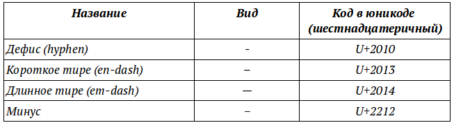
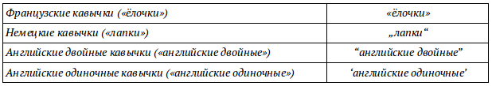

Специальные символы
===================

Дефис, минус, тире и длинное тире
---------------------------------

* *«Вставка → Специальные символы»*

Существует четыре похожие знака: дефис, минус, тире и длинное тире. Здесь они упомянуты в порядке увеличения их длины при начертании.

   
Правила применения и оформления этих знаков очень разнообразны, поэтому будут рассмотрены только некоторые.

Дефис служит для связи частей слов, для разделения слов, а также в качестве знака переноса. Дефис ничем не отбивается [1, c.97].

В правилах русской пунктуации и в отечественной типографике упоминается единый знак «тире». В терминах компьютерных технологий (пришедших из английской типографики) он соответствует так называемому «длинному тире».

Тире не должно быть в начале строки, за исключением случая перед началом прямой речи и использования тире в качестве маркеров пунктов перечисления в списках.

Тире отбивается пробелами по следующим правилам:

* После тире, стоящих в начале абзаца (при прямой речи или в списках), ставится неразрывной пробел обычного размера.
* Тире, обозначающее диапазон значений, границы которого заданы числами (1941—1945, XVI—XVII) пробелами не отбивают.
* Вокруг всех остальных тире предписывается ставить узкие (2 пункта) пробелы, причём перед тире пробел должен быть неразрывным. 
* Тире, идущее за запятой или точкой, по академическим правилам набирается без пробела, однако в современных шрифтах такой набор выглядит некрасиво и от этого требования практически отказались.

Короткое тире обычно ставится между цифрами, например:  2–3 кг. Оно не отбивается от предыдущего и последующего знаков [1, c. 97].

Кавычки
-------

* *«Вставка → Специальные символы»*
* *«Сервис → Параметры автозамены → Национальные»*

Кавычки — парный знак препинания, который употребляется для выделения прямой речи, цитат, отсылок, названий литературных произведений, газет, журналов, предприятий, а также отдельных слов, если они включаются в текст не в своём обычном значении, используются в ироническом смысле, предлагаются впервые или, наоборот, как устаревшие, и т. п.

По своему рисунку различают следующие виды кавычек:

В русском языке традиционно применяются французские «ёлочки», а для кавычек внутри кавычек и при письме от руки — немецкие «лапки».

Правильно: Пушкин писал Дельвигу: «Жду „Цыганов“ и тотчас тисну».

Неправильно: ««Цыганы» мои не продаются вовсе», — сетовал Пушкин.

Во вкладке *«Сервис → Параметры автозамены → Национальные»* можно настроить автозамену кавычек.

Диакритические знаки
--------------------

* *«Вставка → Специальные символы»*

Диакритические знаки — элементы письменности, модифицирующие начертание знаков и обычно набираемые отдельно. Например: Motӧrhead, Mötley Crüe. Буквы ӧ, ü являются диакритическими знаками. 

Ударение
--------

При помощи диакритических знаков можно поставить знак ударения. Для этого нужно установить курсор после символа, над которым необходимо поставить ударение. Далее в меню *«Вставка → Специальные символы»* выбрать символ ударения *«U+0300»* или *«U+0301»*.