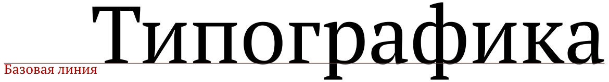

Настройки абзаца
================

Общие настройки абзаца
----------------------

* *«Формат → Абзац»*

Во вкладке *«Формат → Абзац → Положение на странице → Параметры»* рекомендуется снять все галочки:

* не разрывать абзац
* не отрывать от следующего
* запрет начальных висячих строк
* запрет концевых висячих строк

Висячие строки
--------------

* *«Формат → Абзац → Положение на странице → Параметры»*

«Висячая» строка — это строка, которая оторвана от своего абзаца и «висит» в одиночестве на предыдущей или последующей странице. Различают «верхнюю висячую строку» и «нижнюю висячую строку». 

Полного запрета на висячие строки нет — они допустимы при условии, что верхняя висячая строка не короче 2/3 формата набора (то есть ширины текста), а строка перед нижней висячей строкой также не меньше 2/3 формата набора. Проще говоря, висячая строка не должна быть слишком короткой [13].

В LibreOffice есть функция, позволяющая запретить начальные и концевые висячие строки (*«Формат → Абзац → Положение на странице → Параметры»*).  Однако её использование может привести к тому, что в конце листа будет оставаться много свободного места. Поэтому лучше отказаться от использования этой функции и решать проблему ручным способом. Например:

* перефразировать абзац, дополнить его или сократить;
*  убрать в абзаце переносы слов, тогда его длина увеличится;
*  расставить неразрывные пробелы и попытаться «втянуть» строку;
*  немного изменить междустрочный интервал, но это не лучший метод.

Междустрочный интервал (Интерлиньяж)
------------------------------------

* *«Формат → Абзац → Отступы и интервалы → Междустрочный интервал»*
 
Интерлиньяж — междустрочный пробел, расстояние между базовыми линиями соседних строк. В народе зовется «междустрочным интервалом» [9].

Традиционно используются одинарный, полуторный и двойной  интервалы. В *«Формат → Абзац → Отступы и интервалы → Междустрочный интервал»* можно задать своё значение интервала.

Полуторный интервал это расстояние между строками равное половине строки. Двойной интервал — одной строке. Тройной — двум строкам.

Таким образом, если весь текст набирается полуторным интервалом и в некоторых местах должен быть тройной интервал, можно просто вставить пустую строку. В сумме как раз получится тройной интервал. Это не самое лучшее решение, так как интервалы обычно задаются в стилях абзацев.

Нестандартный междустрочный интервал
------------------------------------

Иногда требуется задать нестандартный междустрочный интервал. Например, 18 пунктов. 

В LibreOffice по умолчанию используются сантиметры. В связи с этим существует два способа задать нестандартный интервал.

*Способ 1:* изменить стандартные единицы измерения на пункты. Для этого в *«Сервис → Параметры → LibreOffice Writer → Общие»* выбрать в качестве *«Единицы измерения»* точку. Далее выбрать текст и в *«Вставка → Абзац → Отступы и интервалы»* выставить междустрочный интервал *«Точно»* и присвоить ему значение 18 пт.

*Способ 2:* не изменяя стандартные единицы измерения, нужно 18 пт перевести в миллиметры, при этом следует пользоваться американскими значениями, т. е. 1 пункт = 0,3527 мм. Вычислив значение 18 пт * 0,3527 мм = 6,3486 мм = 0,63 см, подставляем его в *«Вставка → Абзац → Отступы и интервалы»* междустрочный интервал *«Точно»*.

Интервалы между абзацами
------------------------

* *«Формат → Абзац → Отступы и интервалы → Интервал»*

Интервал между абзацами обычно используется когда нужно выставить интервалы между заголовками и текстом. Делать подобные интервалы путем добавления пустых строк считается дурным тоном и наглядно демонстрирует некомпетентность автора. 

Отступы
-------

* *«Формат → Абзац → Отступы и интервалы → Отступ»*

Для установки отступа красной строки необходимо выставить параметр *«Первая строка»*.

Настройки символов
------------------

* *«Формат → Символы»*

Меню *«Символы»* позволяет настраивать параметры текста. Частично оно дублирует функции панели инструментов.

Вкладка *«Шрифт»* содержит параметры гарнитуры, начертания и размера кегля. 
Вкладка *«Эффекты шрифта»* позволяет добавлять эффекты такие как: цвет, контур, тень и т. д. 

Вкладка *«Положение»* позволяет настраивать кернинг, вращать и масштабировать текст.

